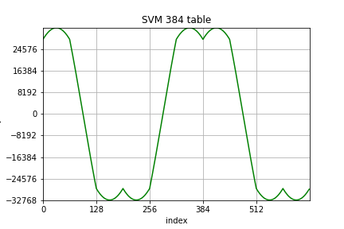
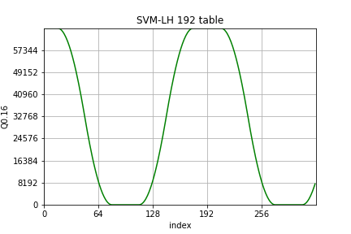
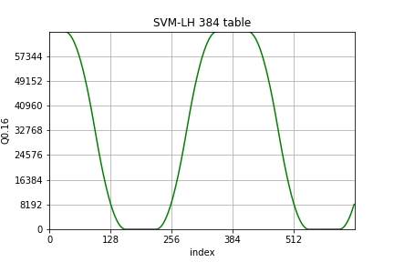

# BU-Act Space-Vector-Modulation table(s)

## General
* Customer: Melexis
* Product(s): *
* Description: Libraries

## Getting started


@image latex lib_svm_table_192.png "192-points SVM-M-shape" width=14cm


@image latex lib_svm_table_384.png "384-points SVM-M-shape" width=14cm


@image latex lib_svm_lh_table_192.png "192-points SVM-LH-shape" width=14cm


@image latex lib_svm_lh_table_384.png "384-points SVM-LH-shape" width=14cm

## Installation

Add *lib_svm_table* to the BU_LIBS list in the file Makefile.srcs.mk located in the application source folder.

```
BU_LIBS += lib_svm_table
```

## Configuration

Add *HAS_192PTS_SVM_M_TABLE* to the app-options to select the 192-points SVM-M table.
Add *HAS_384PTS_SVM_M_TABLE* to the app-options to select the 384-points SVM-M table.
Add *HAS_192PTS_SVM_LH_TABLE* to the app-options to select the 192-points SVM-LH table.
Add *HAS_384PTS_SVM_LH_TABLE* to the app-options to select the 384-points SVM-LH table.

## License
Copyright (C) 2021-2022 Melexis N.V.

The Software is being delivered 'AS IS' and Melexis, whether explicitly or implicitly, makes no warranty as to its Use or performance.
The user accepts the Melexis Firmware License Agreement.

Melexis confidential & proprietary
